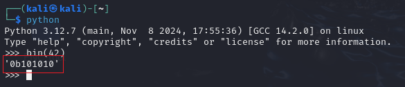

# 2Warm - picoCTF Challenge 🚀💡

**Version**: 1.0  
**Author**: [Trung Huynh](https://www.linkedin.com/in/trung-huynh-chi-pc01/)  

  
  
  

---

## 📜 Challenge Description
The **2Warm** challenge requires converting the decimal number `42` (base 10) to its binary representation (base 2). This task introduces basic number system conversions.

---

## 🛠️ Steps to Solve

1. **Start Python Interpreter:**
   Open the Python interpreter in your terminal:
   ```bash
   python
   ```

2. **Convert to Binary:**
   Use the `bin` function in Python to convert the decimal number:
   ```python
   bin(42)
   ```

3. **Output the Result:**
   The `bin` function returns the binary representation of the number:
   ```python
   '0b101010'
   ```
   The prefix `0b` indicates that the result is in binary.

4. **Remove the Prefix (Optional):**
   If you need only the binary digits:
   ```python
   print(bin(42)[2:])
   ```
   Result:
   ```
   101010
   ```

---

## 🎯 Flag
```
picoCTF{101010}
```

---

## 💡 Key Takeaway
This challenge highlights the simplicity of converting numbers between bases using Python. Understanding these basic operations is fundamental for solving various CTF challenges and programming tasks.

