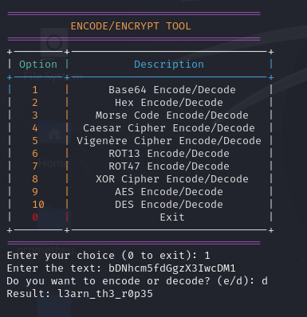

# Bases - picoCTF Challenge 🚀🔐

**Version**: 1.0  
**Author**: [Trung Huynh](https://www.linkedin.com/in/trung-huynh-chi-pc01/)  

  
  
  

---

## 📜 Challenge Description
In this **picoCTF** challenge, you're given the string `bDNhcm5fdGgzX3IwcDM1`. The clue suggests that this has something to do with "bases". Your goal is to decode this string and retrieve the flag.

This challenge requires you to understand how encoding works with different bases, such as **Base64**, and to use the appropriate tools to decode it.

---

## 🛠️ Steps to Solve
    
1. **Download the ENC Tool:**
   To solve this challenge efficiently, use the custom ENC tool:
   ```bash
   git clone https://github.com/huynhtrungcip/ENC_tool.git
  ```
 ```
  
2. **Run the ENC Tool:**
Start the tool using Python:
 ```bash
python3 ENC_tool.py
```
3. **Choose the Base64 Option: From the ENC tool menu, select option 1 for Base64 Encode/Decode:**
```diff
+--------+-------------------------------+
| Option |          Description          |
+--------+-------------------------------+
|   1    |      Base64 Encode/Decode     |
+--------+-------------------------------+
```
4. **Input the Encoded Text: Enter the provided string when prompted:**
   ```bash
   Enter the text: bDNhcm5fdGgzX3IwcDM1
5. **Decode the Text: Choose the decode option (d) when asked:**
   ```bash
   Do you want to encode or decode? (e/d): d
   ```
6. **Retrieve the Flag: The tool will output the decoded flag:**
   ```bash
   Result: l3arn_th3_r0p35
   ```

   ## 🎯 Flag
     ```bash
   picoCTF{l3arn_th3_r0p35}
   ```
   ## 💡 Key Takeaway
```bash
  This challenge demonstrates the simplicity and importance of understanding basic cryptographic techniques like Base64 encoding. 
  Using tools like ENC makes decoding and encoding tasks faster and more efficient.
```
