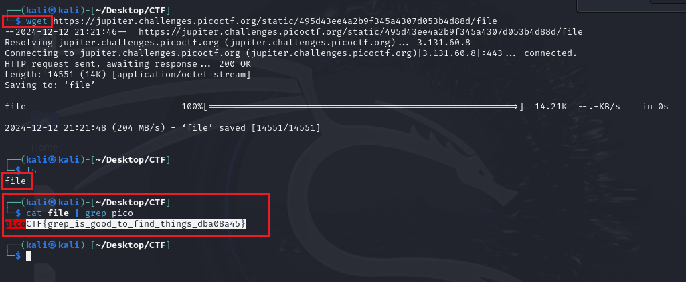

# First Grep - picoCTF Challenge 🌐🔧

**Version**: 1.0  
**Author**: [Huỳnh Trung](https://www.linkedin.com/in/trung-huynh-chi-pc01/)  

  
  
  

---

## 🔍 Introduction

The **First Grep** challenge introduces you to the **grep** command—a versatile tool in Linux/Unix systems used for searching and analyzing text data. This challenge helps you understand how to efficiently search for specific patterns in files, a fundamental skill for log analysis, troubleshooting, and cybersecurity investigations.

### Key Concepts:
1. **Grep Command**:
   - Searches for specific patterns (text or regular expressions) in files.
   - Filters and displays lines containing the desired pattern.
2. **Text Processing**:
   - Combines tools like `grep` with pipelines for efficient data analysis.

By mastering these concepts, you’ll develop essential skills for working with Linux systems and solving CTF challenges.

---

## 🔒 Challenge Description

The **First Grep** challenge asks you to find a hidden flag in a file using the `grep` command. The task emphasizes efficient text searching techniques instead of manual inspection.

---

## 🔧 Steps to Solve

### 1. **Download the File**
   Use the `wget` command to download the provided file:

   ```bash
   wget https://jupiter.challenges.picoctf.org/static/495d43ee4a2b9f345a4307d053b4d88d/file
   ```

   Output:
   ```
   --2024-12-12 21:21:46--  https://jupiter.challenges.picoctf.org/static/495d43ee4a2b9f345a4307d053b4d88d/file
   Resolving jupiter.challenges.picoctf.org (jupiter.challenges.picoctf.org)... 3.131.60.8
   Connecting to jupiter.challenges.picoctf.org (jupiter.challenges.picoctf.org)|3.131.60.8|:443... connected.
   HTTP request sent, awaiting response... 200 OK
   Length: 14551 (14K) [application/octet-stream]
   Saving to: ‘file’

   file                             100%[=========================================================>]  14.21K  --.-KB/s    in 0s
   ```

### 2. **Inspect the File**
   Confirm the file is successfully downloaded:

   ```bash
   ls
   ```
   Output:
   ```
   file
   ```

### 3. **Use the `grep` Command**
   Search for the flag pattern in the file using the `grep` command:

   ```bash
   cat file | grep pico
   ```

   Output:
   ```
   picoCTF{grep_is_good_to_find_things_dba08a45}
   ```

### 4. **Example Walkthrough**
   Below is an example of solving the challenge step-by-step in a terminal:



   The flag is successfully extracted: `picoCTF{grep_is_good_to_find_things_dba08a45}`.

---

## 🎮 Flag
`picoCTF{grep_is_good_to_find_things_dba08a45}`

---

## 💡 Key Takeaway

The **grep** command is an indispensable tool for searching and filtering text data, making it a must-know for cybersecurity professionals and Linux users. Combining `grep` with pipelines simplifies data analysis and enhances productivity. Mastering these techniques is critical for solving CTF challenges and performing efficient log analysis in real-world scenarios.

Feel free to explore similar challenges to deepen your understanding of text searching and command-line utilities!

