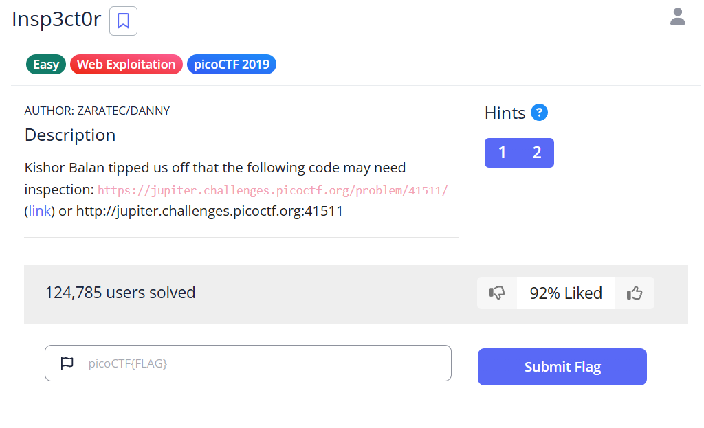
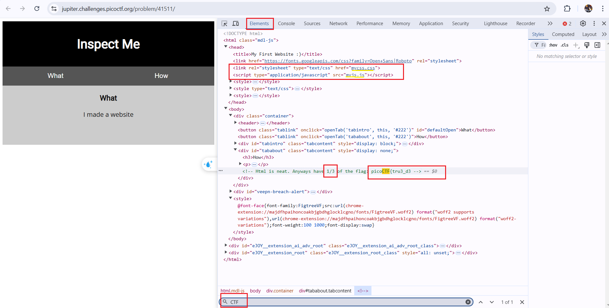
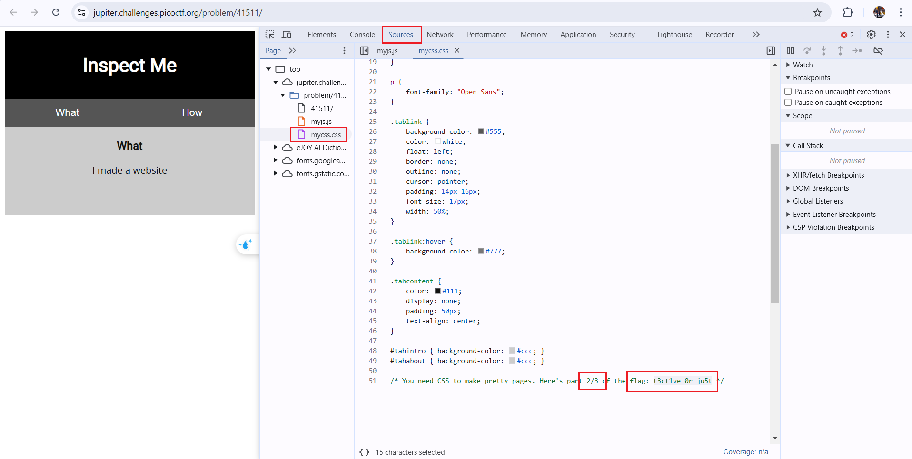
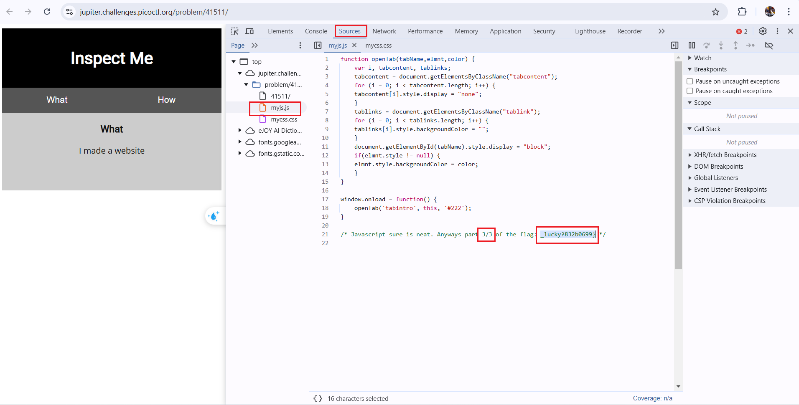
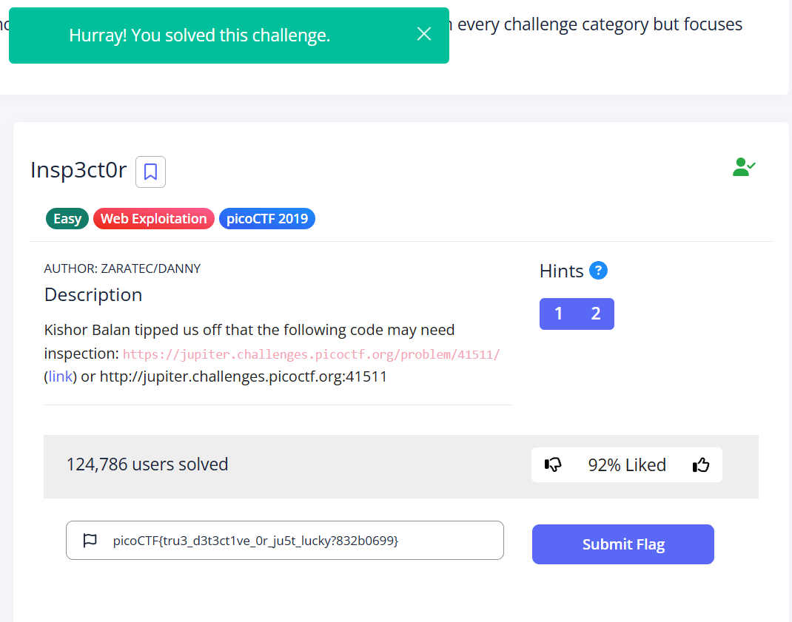

# Insp3ct0r - picoCTF Challenge 🕵️‍♂️💻

**Version**: 1.0  
**Author**: [Trung Huynh](https://www.linkedin.com/in/trung-huynh-chi-pc01/)    

  
  
  

---

## 📚 Introduction

This CTF challenge, **Insp3ct0r**, is part of the **picoCTF Web Exploitation** category. It was created by [zaratec](https://github.com/zaratec) and [danny](https://github.com/danny). In this challenge, you are required to inspect a website and extract the flag hidden in the source code. The challenge provides a great opportunity to practice your web exploitation and inspection skills.

### Challenge Overview

Kishor Balan tipped us off that the following code may need inspection:  
[https://jupiter.challenges.picoctf.org/problem/41511/](https://jupiter.challenges.picoctf.org/problem/41511/)

You are provided with a URL. Your task is to inspect the web page and extract the flag hidden in the HTML, CSS, and JavaScript files.

---

## 🛠️ Steps to Solve

Follow these steps to solve the challenge:

1. **Access the URL**:  
   Open the URL [https://jupiter.challenges.picoctf.org/problem/41511/](https://jupiter.challenges.picoctf.org/problem/41511/) in your browser.

2. **Capture the Request/Response**:  
   Use a tool like **Burp Suite** to capture the request and response. The page will display a message:  
   "I used these to make this site: HTML, CSS, JS (JavaScript)". This suggests that the flag is hidden within the HTML, CSS, and JavaScript files.

3. **Inspect the HTML**:  
   Right-click on the page and select "Inspect Element" or "View Page Source". In the comments, you will find the first part of the flag:  
   `<!-- Html is neat. Anyways have 1/3 of the flag: picoCTF{tru3_d3`.

4. **Inspect the CSS**:  
   Open the linked **CSS file**. In the comments, you will find the second part of the flag:  
   `/* You need CSS to make pretty pages. Here’s part 2/3 of the flag: t3ct1ve_0r_ju5t */`.

5. **Inspect the JavaScript**:  
   Open the linked **JavaScript file**. In the comments, you will find the final part of the flag:  
   `/* Javascript sure is neat. Anyways part 3/3 of the flag: _lucky?832b0699} */`.

6. **Combine the Parts**:  
   After obtaining all three parts of the flag, combine them to get the final flag:  
   `picoCTF{tru3_d3t3ct1ve_0r_ju5t_lucky?832b0699}`.

---

## 🏆 Challenge Solved

Congratulations! You've successfully solved the **Insp3ct0r** challenge.

---

## 🤝 Contributions

Feel free to fork this repository and contribute! Open pull requests are always welcome.

---

## 🔗 Resources

- [Burp Suite](https://portswigger.net/burp)
- [picoCTF](https://picoctf.org/)
