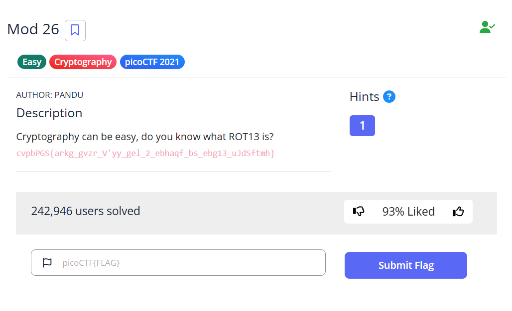
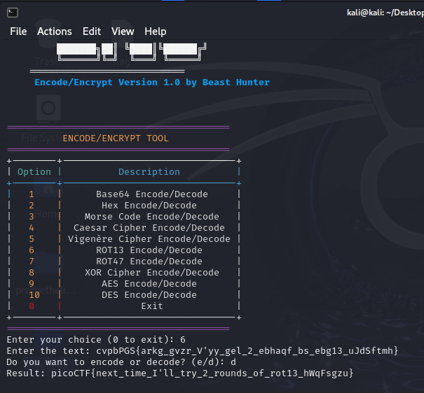

# Mod 26 - picoCTF Challenge 🚀🔐

**Version**: 1.0  
**Author**: [Trung Huynh](https://www.linkedin.com/in/trung-huynh-chi-pc01/)  

  
  
  

---

## 📜 Challenge Description
The **Mod 26** challenge focuses on cryptography, specifically the ROT13 cipher. You are tasked with decoding a given ROT13-encrypted string to reveal the flag.

    
---

## 🛠️ Steps to Solve

1. **Download the ENC Tool:**
   To solve this challenge efficiently, use the custom ENC tool:
   ```bash
   git clone https://github.com/huynhtrungcip/ENC_tool.git
   ```
   Navigate to the tool's directory:
   ```bash
   cd ENC_tool
   ```

2. **Run the ENC Tool:**
   Start the tool using Python:
   ```bash
   python3 ENC_tool.py
   ```

3. **Choose the ROT13 Option:**
   From the ENC tool menu, select option `6` for ROT13 Encode/Decode:
   ```
   +--------+-------------------------------+
   | Option |          Description          |
   +--------+-------------------------------+
   |   6    |      ROT13 Encode/Decode      |
   +--------+-------------------------------+
   ```

4. **Input the Encrypted Text:**
   Enter the provided text when prompted:
   ```bash
   Enter the text: cvpbPGS{arkg_gvzr_V'yy_gel_2_ebhaqf_bs_ebg13_uJdSftmh}
   ```

5. **Decode the Text:**
   Choose the decode option (`d`) when asked:
   ```bash
   Do you want to encode or decode? (e/d): d
   ```

6. **Retrieve the Flag:**
   The tool will output the decoded flag:
   ```bash
   Result: picoCTF{next_time_I'll_try_2_rounds_of_rot13_hWqFsgzu}
   ```
      
---

## 🎯 Flag
```
picoCTF{next_time_I'll_try_2_rounds_of_rot13_hWqFsgzu}
```

---

## 💡 Key Takeaway
This challenge demonstrates the simplicity and importance of understanding basic cryptographic techniques like ROT13. Using tools like ENC makes decoding and encoding tasks faster and more efficient.

