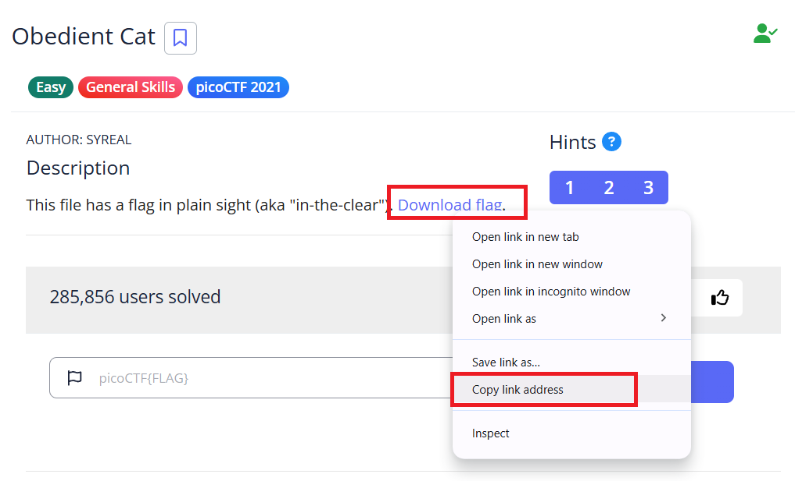
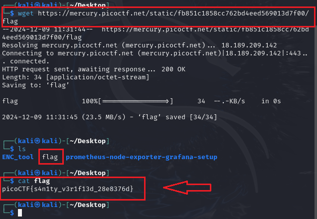

# Obedient Cat - picoCTF Challenge 🚀🐾

**Version**: 1.0  
**Author**: [Trung Huynh](https://www.linkedin.com/in/trung-huynh-chi-pc01/)  

  
  
  

---

## 📜 Challenge Description
The task requires downloading a file and using basic Linux commands to retrieve the flag.

---

## 🛠️ Steps to Solve

1. **Download the file:**
   ```bash
   wget https://mercury.picoctf.net/static/fb851c1858cc762bd4eed569013d7f00/flag
   ```
   This command downloads the file named `flag` from the provided URL.

2. **List the downloaded file:**
   ```bash
   ls
   ```
   Ensure the `flag` file is in the current directory.

3. **Read the contents of the file:**
   ```bash
   cat flag
   ```
   Output:
   ```
   picoCTF{s4n1ty_v3r1f13d_28e8376d}
   ```
   
---

## 🎯 Flag
```
picoCTF{s4n1ty_v3r1f13d_28e8376d}
```

---

## 💡 Key Takeaway
This challenge demonstrates the importance of knowing basic Linux commands like `wget`, `ls`, and `cat` for handling files and solving CTF tasks.


