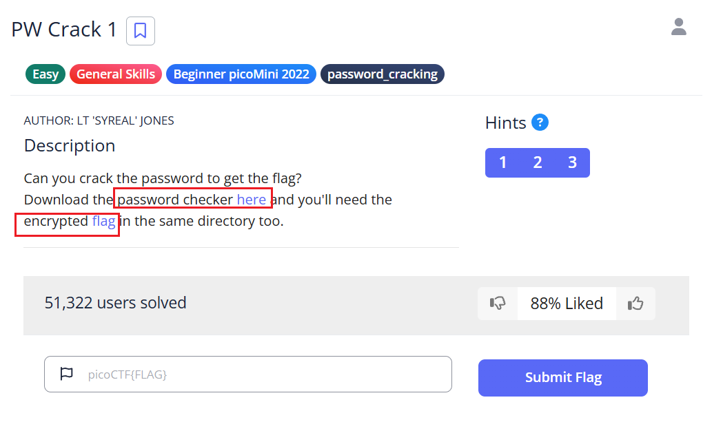
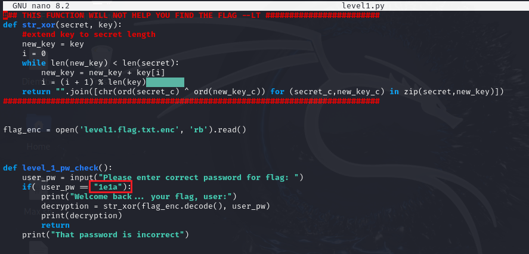
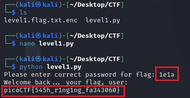
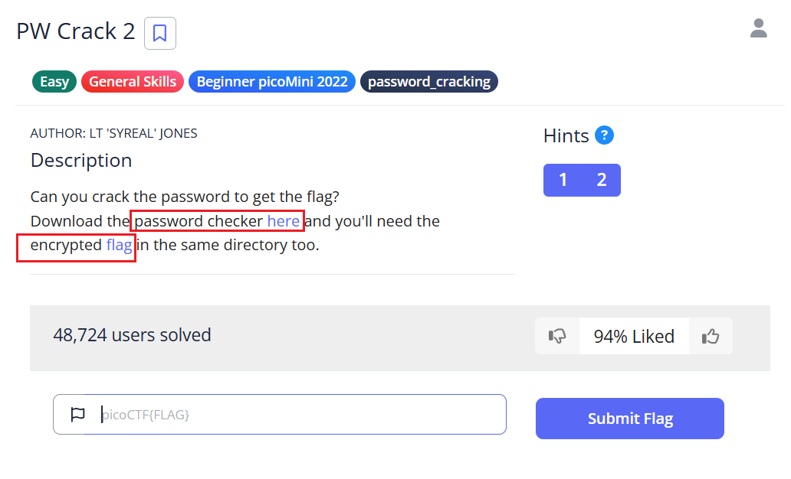
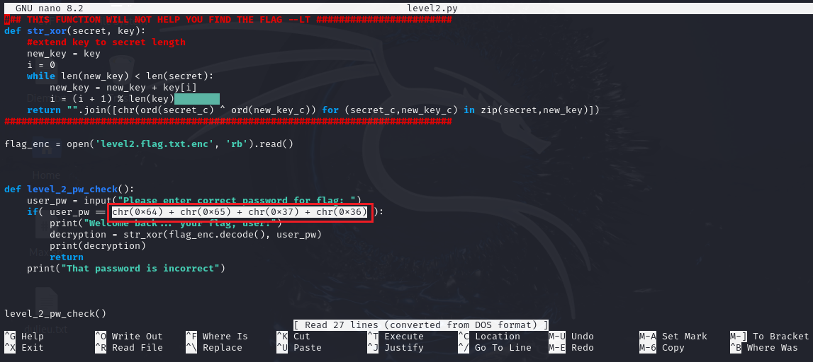
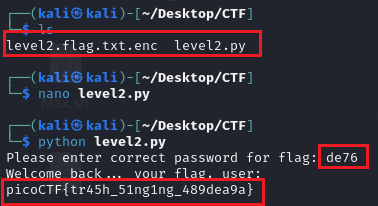
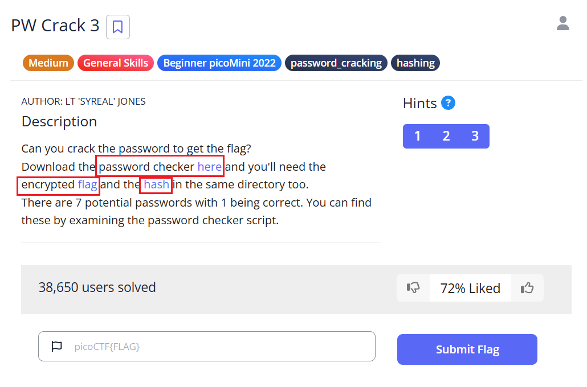
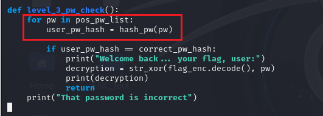
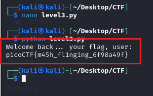

# **Password Cracking 1 2 3 4 5 - picoCTF Challenge 🔐**

**Version**: 1.0  
**Author**: [Huỳnh Trung](https://www.linkedin.com/in/trung-huynh-chi-pc01/)  

  
  
  

---

## 🗝️ PW Crack 1

### 📝 Description
Can you crack the password to get the flag? Download the password checker and encrypted flag into the same directory.

### 💡 Hints
- **Hint 1**: Use `nano level1.py` to inspect the code.
- **Hint 2**: Exit `nano` using `Ctrl + X`.
- **Hint 3**: No need to reverse-engineer the `str_xor` function.

### 🔧 Solution
1. Open the file with the following command:
   ```bash
   nano level1.py
   ```
   
2. Find the password in the script.
3. Run the script:
   ```bash
   python3 level1.py
   ```
4. Input the password to reveal the flag.

### 🚩 Flag
`picoCTF{545h_r1ng1ng_fa343060}`

---

## 🗝️ PW Crack 2

### 📝 Description
Another password challenge! Decrypt the password encoded in hexadecimal.

### 💡 Hints
- **Hint 1**: Recognize the encoding? Convert hex to ASCII.
- **Hint 2**: Ignore the `str_xor` function for now.

### 🔧 Solution
1. Open the file with the following command:
   ```bash
   nano level2.py
   ```

2. Decode the hex values. Use Python for quick conversion:
   ```python
   password = chr(0x64) + chr(0x65) + chr(0x37) + chr(0x36)
   print(password)  # Output: de76
   ```
3. Run the script:
   ```bash
   python3 level2.py
   ```
4. Enter the password (`de76`) to get the flag.


### 🚩 Flag
`picoCTF{tr45h_51ng1ng_489dea9a}`

---

## 🗝️ PW Crack 3
 
### 📝 Description
Crack the password by iterating through potential candidates.

### 💡 Hints
- **Hint 1**: Look at the `pos_pw_list` in the script.
- **Hint 2**: Update the script to automate password testing.

### 🔧 Solution
1. Download the required files:
   ```bash
   wget https://artifacts.picoctf.net/c/18/level3.py
   wget https://artifacts.picoctf.net/c/18/level3.flag.txt.enc
   wget https://artifacts.picoctf.net/c/18/level3.hash.bin
   ```
2. Open the script:
   ```bash
   nano level3.py
   ```
    
3. Modify it to test all passwords automatically:
   ```python
   def level_3_pw_check():
       for pw in pos_pw_list:
           user_pw_hash = hash_pw(pw)
           if user_pw_hash == correct_pw_hash:
               print("Welcome back... your flag, user:")
               decryption = str_xor(flag_enc.decode(), pw)
               print(decryption)
               return
       print("That password is incorrect")

   pos_pw_list = ["8799", "d3ab", "1ea2", "acaf", "2295", "a9de", "6f3d"]
   level_3_pw_check()
   ```
    
4. Save changes and run the script:
   ```bash
   python3 level3.py
   ```
5. The correct password is found, and the flag is revealed.
 
### 🚩 Flag
`picoCTF{m45h_fl1ng1ng_6f98a49f}`

---

## 🎉 Conclusion

Great job! You’ve successfully cracked the passwords!

**🔐 Author**: Huỳnh Trung

