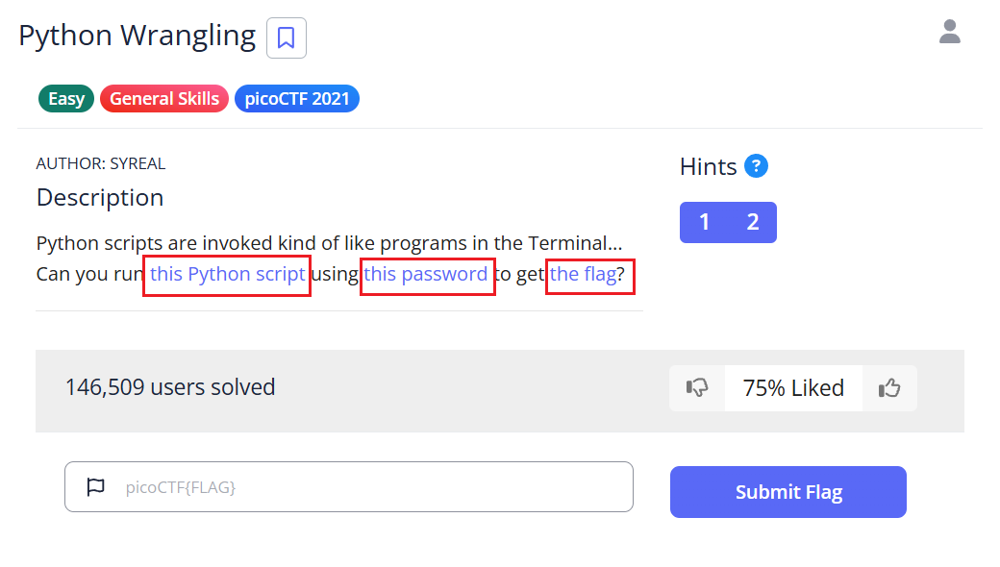
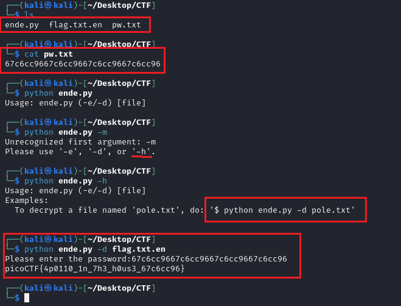

# Python Wrangling - picoCTF Challenge 🔖💻

**Version**: 1.0  
**Author**: [Huỳnh Trung](https://www.linkedin.com/in/trung-huynh-chi-pc01/)  

  
  
  

---

## 📁 Introduction

The **Python Wrangling** challenge teaches us about Python scripts and how to use them effectively in the terminal. By solving this challenge, you will learn how to:

1. Analyze a Python script to understand its purpose.
2. Execute Python scripts with proper arguments.
3. Provide passwords to decrypt files and extract flags.

This challenge demonstrates the use of the **Fernet encryption** algorithm, a symmetric encryption method provided by Python's `cryptography` library. Let's dive into the solution step by step!

---

## 🔧 Steps to Solve

### 1. **Download Required Files**
   Use the `wget` command to download the necessary files from the challenge:
   
   ```bash
   wget https://mercury.picoctf.net/static/b351a89e0bc6745b00716849105f87c6/ende.py
   wget https://mercury.picoctf.net/static/b351a89e0bc6745b00716849105f87c6/pw.txt
   wget https://mercury.picoctf.net/static/b351a89e0bc6745b00716849105f87c6/flag.txt.en
   ```

   Confirm the files have been downloaded:
   
   ```bash
   ls
   ```
   Output:
   ```
   ende.py  flag.txt.en  pw.txt
   ```

### 2. **Inspect the Python Script**
   Open `ende.py` to understand its functionality:
   
   ```bash
   cat ende.py
   ```
   This script allows users to encrypt (`-e`) and decrypt (`-d`) files using a password.

### 3. **Understand Usage Instructions**
   Run the script without arguments to view the usage instructions:
   
   ```bash
   python3 ende.py
   ```
   Output:
   ```
   Usage: ende.py (-e/-d) [file]
   ```
   You can:
   - Use `-e` to encrypt a file.
   - Use `-d` to decrypt a file.

### 4. **Decrypt the Flag File**
   Use the `-h` option to get additional help:
   
   ```bash
   python3 ende.py -h
   ```
   Output:
   ```
   Usage: ende.py (-e/-d) [file]
   Examples:
     To decrypt a file named 'pole.txt', do: '$ python3 ende.py -d pole.txt'
   ```

   Run the decryption command with the `flag.txt.en` file:
   
   ```bash
   python3 ende.py -d flag.txt.en
   ```
   When prompted, enter the password from `pw.txt`:
   
   ```bash
   cat pw.txt
   ```
   Output:
   ```
   67c6cc9667c6cc9667c6cc9667c6cc96
   ```

   Enter the password in the decryption command:
   
   ```bash
   Please enter the password: 67c6cc9667c6cc9667c6cc9667c6cc96
   ```
   Output:
   ```
   picoCTF{4p0110_1n_7h3_h0us3_67c6cc96}
   ```

### 5. **Example Walkthrough**
   Here's the full process in action:
   


---

## 🔹 Flag
`picoCTF{4p0110_1n_7h3_h0us3_67c6cc96}`

---

## 💡 Key Takeaway

This challenge highlights the use of:
1. **Symmetric Encryption**: Using the Fernet algorithm for secure data handling.
2. **Python Scripting**: Writing and executing Python scripts to manage file encryption and decryption.

By understanding these techniques, you are better equipped to handle real-world cryptographic challenges and enhance your cybersecurity skills. Great work! 🎉

