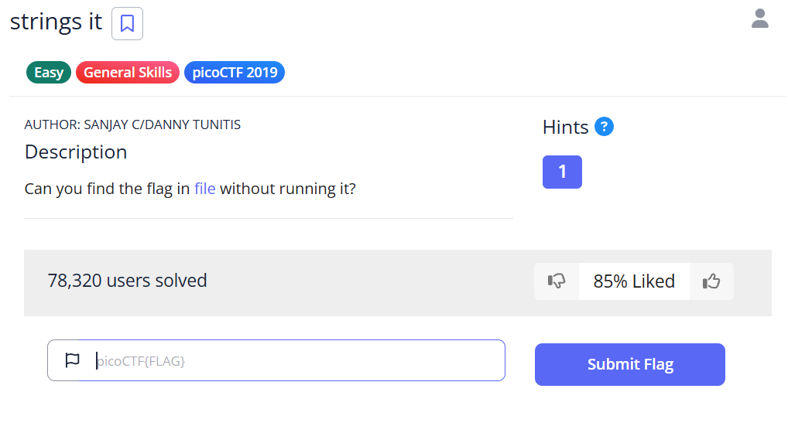
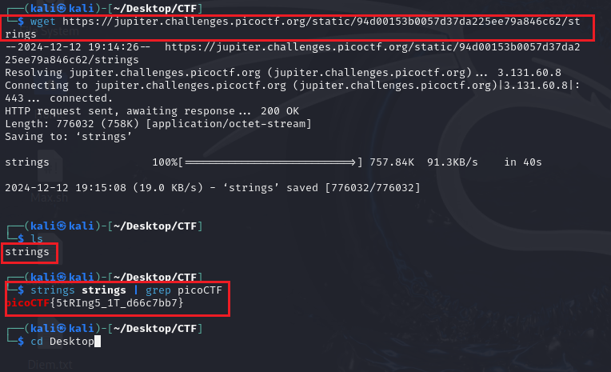

# Strings It - picoCTF Challenge 🌐🔧

**Version**: 1.0  
**Author**: [Huỳnh Trung](https://www.linkedin.com/in/trung-huynh-chi-pc01/)  

  
  
  

---

## 📑 Introduction

This challenge introduces you to the **strings** command—a powerful tool in Linux for extracting printable strings from binary or other file types. The challenge, "Strings it," asks us to find a hidden flag in a file without executing it. By mastering the **strings** command, you'll enhance your ability to analyze files and uncover embedded text, a critical skill for reverse engineering and forensics in cybersecurity.

### Key Concepts:
1. **Strings Command**:
   - Extracts printable text from files.
   - Useful for identifying hidden messages, flags, or clues in binary files.
2. **Command Piping**:
   - Combines the output of one command with another using `|`.
3. **Text Filtering with grep**:
   - Searches for specific patterns in text.

By applying these concepts, you’ll efficiently locate hidden flags and gain insight into analyzing files in a non-intrusive way.

---

## 🖊️ Challenge Description

The **Strings it** challenge focuses on extracting the flag from a file using the Linux `strings` command. The task encourages you to analyze the file content without executing it, emphasizing non-intrusive investigation techniques.

---

## 🔧 Steps to Solve

### 1. **Download the File**
   Start by downloading the file provided in the challenge:
   
   ```bash
   wget https://jupiter.challenges.picoctf.org/static/94d00153b0057d37da225ee79a846c62/strings
   ```

### 2. **Inspect the File**
   Verify the file is successfully downloaded and inspect its type:
   
   ```bash
   ls
   file strings
   ```
   
   Output:
   ```
   strings: ELF 64-bit LSB executable, x86-64, version 1 (SYSV), dynamically linked
   ```
   This indicates the file is a binary executable.

### 3. **Use the `strings` Command**
   Extract all printable text from the file using the `strings` command:
   
   ```bash
   strings strings
   ```
   
   This command outputs all readable strings found in the binary.

### 4. **Search for the Flag**
   To locate the flag, pipe the output of `strings` into the `grep` command and search for `picoCTF{`:
   
   ```bash
   strings strings | grep picoCTF{
   ```
   
   Output:
   ```
   picoCTF{5tRIng5_1T_d66c7bb7}
   ```
   
   The flag is identified as `picoCTF{5tRIng5_1T_d66c7bb7}`.

### 5. **Example Walkthrough**
   Here's an example of solving the challenge step-by-step in a terminal:
   


---

## 🎯 Flag
`picoCTF{5tRIng5_1T_d66c7bb7}`

---

## 💡 Key Takeaway

The **strings** command is an essential tool for extracting readable text from files, making it invaluable for reverse engineering and forensics. Combining it with tools like `grep` enables efficient pattern searching, saving time and effort in identifying critical information. Mastering these techniques will enhance your ability to solve CTF challenges and analyze files effectively in real-world scenarios.

Feel free to explore similar challenges to deepen your understanding of file analysis and command-line tools!

