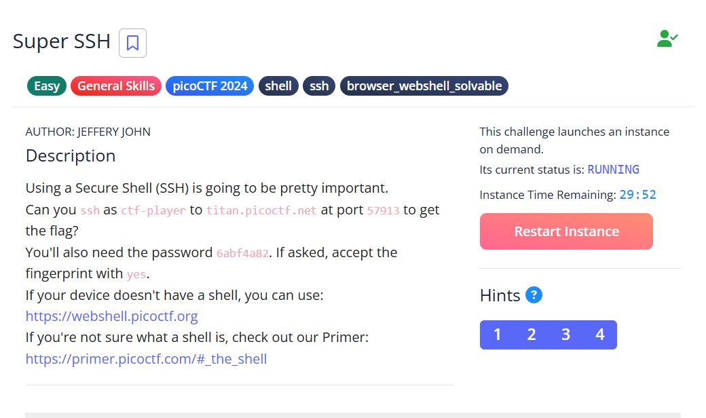
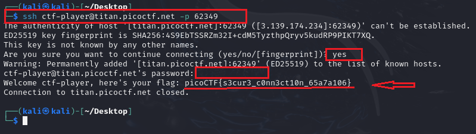

# Super SSH - picoCTF Challenge 🚀🔑

**Version**: 1.0  
**Author**: [Trung Huynh](https://www.linkedin.com/in/trung-huynh-chi-pc01/)  

  
  
  

---

## 📜 Challenge Description
The **Super SSH** challenge tests your ability to connect to a remote server via SSH and retrieve the flag.
This requires understanding SSH commands, handling public key authentication, and interacting securely with the server.

---

## 🛠️ Steps to Solve

1. **Initial SSH Attempt:**
   Try connecting using the provided username and port:
   ```bash
   ssh ctf-player@titan.picoctf.net 62349
   ```
   Output:
   ```
   ctf-player@titan.picoctf.net: Permission denied (publickey).
   ```
   This indicates the server requires a password or public key for authentication.

2. **Connect Using Port Specification:**
   Use the `-p` flag to specify the correct port:
   ```bash
   ssh ctf-player@titan.picoctf.net -p 62349
   ```
   Upon connecting, you'll see a prompt about the host's authenticity:
   ```
   Are you sure you want to continue connecting (yes/no/[fingerprint])?
   ```
   Type `yes` to proceed. The server's key will be added to your known hosts.

3. **Enter the Password:**
   When prompted, enter the password provided in the challenge details. After successful authentication, the flag will be displayed:
   ```
   Welcome ctf-player, here's your flag: picoCTF{s3cur3_c0nn3ct10n_65a7a106}
   ```
  
4. **Close the Connection:**
   The connection will close automatically after retrieving the flag.

---

## 🎯 Flag
```
picoCTF{s3cur3_c0nn3ct10n_65a7a106}
```

---

## 💡 Key Takeaway
This challenge demonstrates the importance of understanding SSH protocols, secure authentication, and host authenticity verification for safe remote connections.

