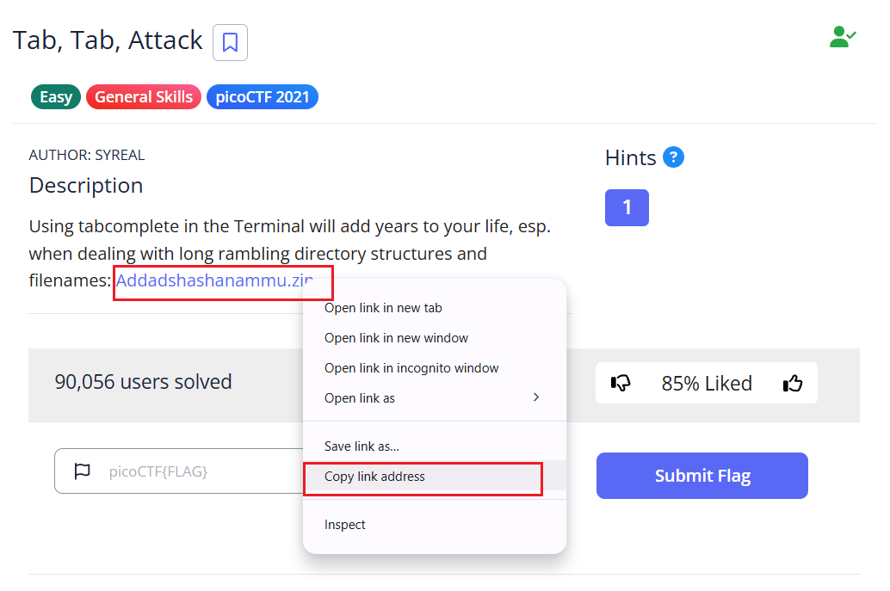
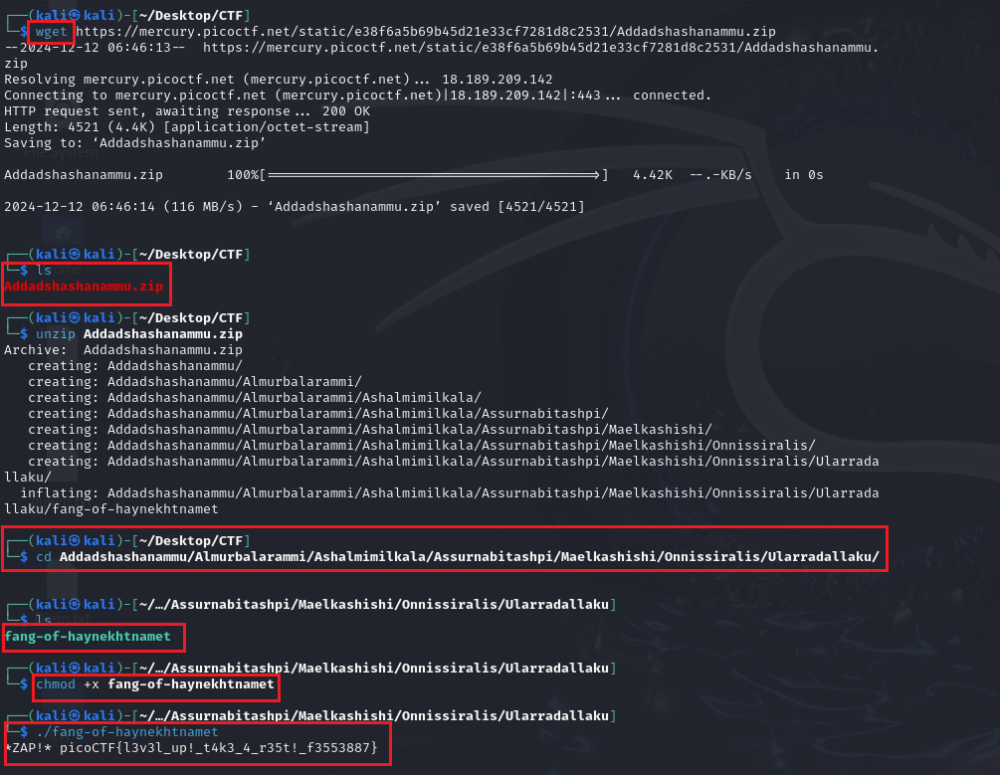

# Tab, Tab, Attack - picoCTF Challenge 🚀💻

**Version**: 1.0  
**Author**: [Huỳnh Trung](https://www.linkedin.com/in/trung-huynh-chi-pc01/)  

  
  
  

---


## 📚 Introduction

This challenge is a practical introduction to **tab-completion** in Linux. Tab-completion is a feature of most Unix-like operating systems that helps users complete file names, directory names, and commands by pressing the `Tab` key. It's a critical skill for anyone working in terminal-based environments, particularly for tasks involving deeply nested directories or files with complex names.

### Key Concepts:
1. **Tab-Completion**:
   - Saves time by reducing the need to type long file or directory names.
   - Prevents errors caused by typos.
2. **File Permissions**:
   - Understanding and modifying file permissions using `chmod` is essential for running scripts or binary files.
3. **ZIP File Operations**:
   - The `unzip` command is commonly used for extracting archives.
4. **Executing Binary Files**:
   - Binary files may need execution permissions (`chmod +x`) before running them with `./filename`.

By mastering these concepts, you will gain confidence in terminal navigation, file operations, and binary execution, which are key skills in cybersecurity and CTF challenges.

---

## 📜 Challenge Description

The **Tab, Tab, Attack** challenge emphasizes the efficiency of using tab-completion in a Linux terminal. This feature is particularly useful when navigating deeply nested directory structures or dealing with long filenames. 

The task involves downloading a ZIP archive, extracting it, navigating to the correct directory, and executing a binary file to retrieve the flag.

---


## 🛠️ Steps to Solve

### 1. **Download the ZIP File:**
   Use the `wget` command to download the provided ZIP file:
   ```bash
   wget https://mercury.picoctf.net/static/e38f6a5b69b45d21e33cf7281d8c2531/Addadshashanammu.zip
   ```

### 2. **Verify the Download:**
   Confirm the file has been successfully downloaded:
   ```bash
   ls
   ```
   Output:
   ```
   Addadshashanammu.zip
   ```

### 3. **Extract the ZIP File:**
   Extract the archive using the `unzip` command:
   ```bash
   unzip Addadshashanammu.zip
   ```

### 4. **Navigate Through Directories:**
   Use the `cd` command (along with **tab-completion**) to navigate through the nested directories:
   ```bash
   cd Addadshashanammu/Almurbalarammi/Ashalmimilkala/Assurnabitashpi/Maelkashishi/Onnissiralis/Ularradallaku/
   ```

### 5. **List the Files in the Directory:**
   Verify the presence of the binary file:
   ```bash
   ls
   ```
   Output:
   ```
   fang-of-haynekhtnamet
   ```

### 6. **Grant Execution Permission:**
   Make the binary executable:
   ```bash
   chmod +x fang-of-haynekhtnamet
   ```

### 7. **Run the Binary:**
   Execute the binary file to retrieve the flag:
   ```bash
   ./fang-of-haynekhtnamet
   ```
   Output:
   ```
   *ZAP!* picoCTF{l3v3l_up!_t4k3_4_r35t!_f3553887}
   ```

---



## 🎯 Flag
```
picoCTF{l3v3l_up!_t4k3_4_r35t!_f3553887}
```

---

## 💡 Key Takeaway

This challenge highlights the efficiency of using **tab-completion** in the Linux terminal. It saves time and reduces errors when dealing with deeply nested directories or lengthy filenames. Mastering this skill is crucial for CTF challenges and Linux-based tasks in real-world scenarios.

Feel free to explore similar challenges to deepen your understanding of terminal navigation and automation!
