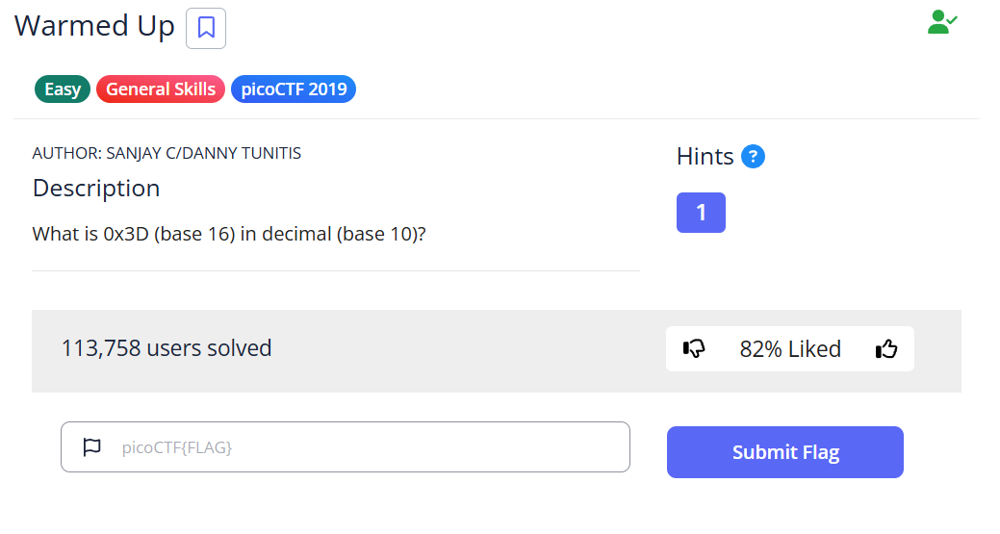
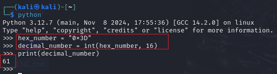

# Warmed Up - picoCTF Challenge 🚀🔥

**Version**: 1.0  
**Author**: [Trung Huynh](https://www.linkedin.com/in/trung-huynh-chi-pc01/)  

  
  
  

---

## 📜 Challenge Description
The **Warmed Up** challenge tests your ability to convert numbers between different bases. In this task, you need to convert `0x3D` (base 16) into its decimal (base 10) equivalent.

---
  
## 🛠️ Steps to Solve

1. **Start Python Interpreter:**
   Open the Python interpreter in your terminal:
   ```bash
   python
   ```

2. **Define the Hexadecimal Number:**
   Assign the hexadecimal value `0x3D` to a variable:
   ```python
   hex_number = "0x3D"
   ```

3. **Convert to Decimal:**
   Use the `int` function with base 16 to convert the number:
   ```python
   decimal_number = int(hex_number, 16)
   ```

4. **Print the Result:**
   Output the decimal equivalent:
   ```python
   print(decimal_number)
   ```
   Result:
   ```
   61
   ```

---
  
## 🎯 Flag
```
picoCTF{61}
```

---

## 💡 Key Takeaway
This challenge demonstrates the ease of converting between number bases using Python. Understanding such conversions is crucial for solving many cryptographic and binary challenges in CTFs.

