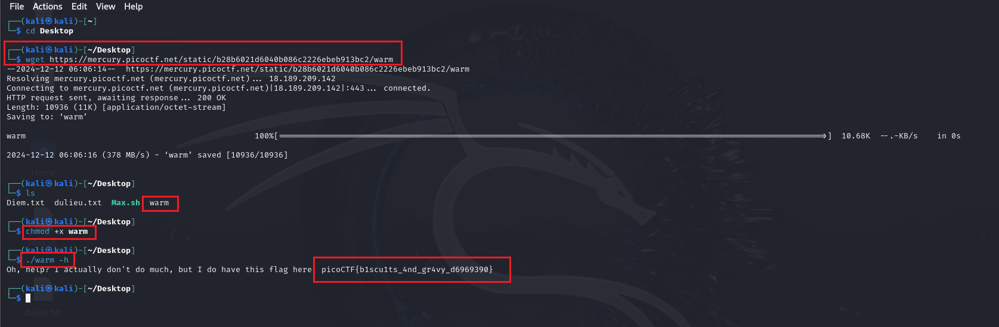

# Wave a Flag - picoCTF Challenge 🏴‍☠️🔍

**Version**: 1.0  
**Author**: [Trung Huynh](https://www.linkedin.com/in/trung-huynh-chi-pc01/)

  
  
  

---


## 🌟 Introduction
The **Wave a Flag** challenge is an entry-level task designed to familiarize participants with the basics of working with command-line binaries. It highlights the importance of understanding command-line flags and how they can be used to interact with and extract information from programs. By solving this challenge, you will gain insight into the role of flags (`-h`, `--help`, etc.) and their utility in debugging and navigating unfamiliar software.

This exercise is a great starting point for beginners aiming to enhance their proficiency with terminal commands and binary analysis. It demonstrates how even simple commands can unveil valuable information in the context of CTF challenges and real-world scenarios.

---

## 📜 Challenge Description
The **Wave a Flag** challenge focuses on exploring the functionality of a binary file. The objective is to discover the flag by invoking the appropriate help flag (`-h`) of the provided binary file. This task encourages learning how to interact with command-line tools effectively.

---

## 🛠️ Steps to Solve


### 1. **Download the Binary File:**
   Use the `wget` command to download the binary file from the given URL:
   ```bash
   wget https://mercury.picoctf.net/static/b28b6021d6040b086c2226ebeb913bc2/warm
   ```

### 2. **Verify the Download:**
   Confirm the file has been successfully downloaded:
   ```bash
   ls
   ```
   Output:
   ```
   warm
   ```

### 3. **Grant Execution Permission:**
   Make the binary file executable:
   ```bash
   chmod +x warm
   ```

### 4. **Run the Help Command:**
   Execute the binary file with the `-h` flag to reveal the help message and the flag:
   ```bash
   ./warm -h
   ```

### 5. **Retrieve the Flag:**
   Output:
   ```
   Oh, help? I actually don't do much, but I do have this flag here: picoCTF{b1scu1ts_4nd_gr4vy_d6969390}
   ```

---



## 🎯 Flag
```
picoCTF{b1scu1ts_4nd_gr4vy_d6969390}
```

---

## 💡 Key Takeaway
This challenge demonstrates the importance of leveraging command-line flags and understanding binary files. Such skills are invaluable in CTF challenges and real-world debugging scenarios.

Feel free to explore similar challenges to strengthen your foundational knowledge!

