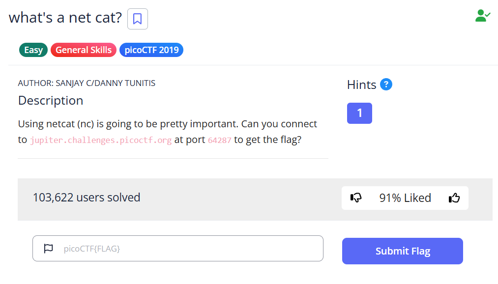

# What's a Net Cat? - picoCTF Challenge 🚀🐱

**Version**: 1.0  
**Author**: [Trung Huynh](https://www.linkedin.com/in/trung-huynh-chi-pc01/)  

  
  
  

---

## 📜 Challenge Description
The **What's a Net Cat?** challenge introduces the powerful `netcat` tool, which is essential for many CTF challenges.
Your goal is to connect to a remote server and retrieve the flag using `nc` (netcat).

---

## 🛠️ Steps to Solve


1. **Connect to the Server:**
   Use the `nc` command to connect to the server:
   ```bash
   nc jupiter.challenges.picoctf.org 64287
   ```

2. **Interact with the Server:**
   After connecting, you will see the following message:
   ```
   You're on your way to becoming the net cat master
   picoCTF{nEtCat_Mast3ry_284be8f7}
   ```
   This indicates the successful completion of the challenge.

3. **Record the Flag:**
   Save the flag for submission:
   ```
   picoCTF{nEtCat_Mast3ry_284be8f7}
   ```
    
---

## 🎯 Flag
```
picoCTF{nEtCat_Mast3ry_284be8f7}
```

---

## 💡 Key Takeaway
This challenge highlights the utility of `netcat` for establishing connections and interacting with remote servers. Mastering this tool is crucial for many CTF challenges and real-world network tasks.

